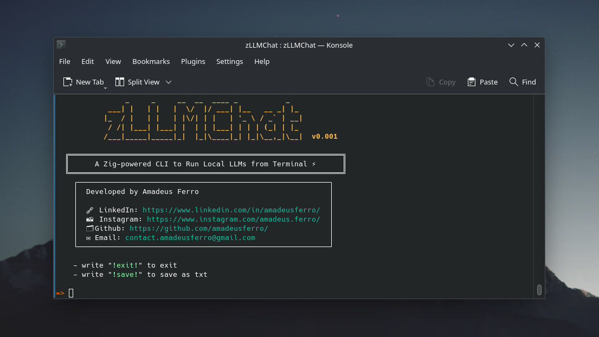

# zLLMChat ⚡🦖💬

Welcome to **zLLMChat**\! A powerful and highly customizable chat interface to run your favorite Large Language Models locally. Built with the speed of **Zig** and the robustness of `llama.cpp`.
I didn’t know much about LLMs, so I decided to build this project with a lower level backend to really learn how they work — using the incredible and robust `llama.cpp`.



-----

## ✨ Features

  * **⚙️ Highly Customizable:** Fine-tune everything from memory usage to attention mechanisms.
  * **🧠 Advanced Sampling:** Go beyond greedy decoding with over a dozen sampling methods, including `Top-P`, `Mirostat`, and `Min-P`.
  * **🖥️ Full GPU Offloading:** Accelerate inference by offloading model layers to your NVIDIA GPU with CUDA.
  * **📦 Docker Support:** Get up and running in minutes with the provided Dockerfile for a clean, containerized environment.
  * **⚡ Blazing Fast:** Combines the performance of Zig with the optimized C++ backend of `llama.cpp`.

-----

## 🛠️ Installation & Setup

You can get started by building from source or using the provided Docker container.

### 🐳 Method 1: Build with Docker (Recommended)

**1. Clone the repository**

```bash
git clone https://github.com/amadeusferro/zLLMChat
cd zLLMChat
```

**2. Build the Docker image** 

```bash
sudo docker build -t zllmchat .
```

**3. Run the container**
This command starts the container and links your local model directory to the container's filesystem.

```bash
# IMPORTANT: Replace "/your/local/path/to/models" with the actual path on your computer
sudo docker run --gpus all -it -v "/your/local/path/to/models":/zLLMChat/models zllmchat
```

**4. Build and Run zLLMChat**
The recommended way is to use a `params.json` file to configure your model path and params. Although, you can also use CLI to configure it.

First, **build the application**:

```bash
# Build with support for loading parameters from an external JSON file
zig build -DPARAMS_FROM_JSON=true
# Build with support for manually loading parameters from CLI
zig build
```

Then, **run it**:

```bash
./zig-out/bin/zLLMChat
```

https://github.com/user-attachments/assets/333ab716-94a5-4ff1-a7ca-145bc37a1ecc

---

### 💻 Method 2: Build from Source

### 📋 Prerequisites

Make sure you have the following tools installed on your system. For Debian/Ubuntu, run:

```bash
# Update package list and install dependencies
sudo apt-get update && sudo apt-get install -y \
    build-essential \
    cmake \
    make \
    git \
    gcc \
    clang \
    curl \
    libcurl4-openssl-dev \
    python3 \
    python3-pip \
    wget \
    xz-utils \
    libboost-all-dev \
    libeigen3-dev \
    libopenblas-dev
```

> 
**Note:** Of course, you also need [Zig ](https://ziglang.org/) to run it.

**Note:** For GPU acceleration, you also need the [NVIDIA CUDA Toolkit](https://developer.nvidia.com/cuda-toolkit).

**1. Clone the repository**

```bash
git clone https://github.com/amadeusferro/zLLMChat
cd zLLMChat
```

**2. Run the build script**
These scripts compile the `llama.cpp` backend.

```bash
# If you have an NVIDIA GPU
./build_with_cuda

# If you are using CPU only
./build_without_cuda
```

**3. Build and Run zLLMChat**
The recommended way is to use a `params.json` file to configure your model path and params. Although, you can also use CLI to configure it.

First, **build the application**:

```bash
# Build with support for loading parameters from an external JSON file
zig build -DPARAMS_FROM_JSON=true
# Build with support for manually loading parameters from CLI
zig build
```

Then, **run it**:

```bash
./zig-out/bin/zLLMChat
```

https://github.com/user-attachments/assets/6b04414b-ba90-48a8-9a44-9f0c16e36547

-----

## 📥 Downloading GGUF Models

In order to chat with any model using **zLLMChat**, you need to download a `.gguf` file — a format designed for efficient, portable execution of large language models.

### ❓ What is GGUF?

**GGUF (GPT-Generated Unified Format)** is a next-generation file format created by the [llama.cpp](https://github.com/ggerganov/llama.cpp) team. It offers:

* ✅ Compatibility across many inference tools
* 🧠 Embedded metadata for easier configuration
* 🚀 Optimized support for quantization and GPU acceleration

zLLMChat uses GGUF to load and run language models with maximum efficiency.

### 📌 Recommended Models

You can find thousands of open-source models hosted on [Hugging Face](https://huggingface.co), many of which are available in the GGUF format.

Here are some popular, high-quality options tested with zLLMChat:

| Model Name | Download Link |
|------------|---------------|
| Meta-Llama-3-8B-Instruct.Q2_K.gguf | [Download](https://huggingface.co/meta-llama/Meta-Llama-3-8B-Instruct) |
| mistral-7b-instruct-v0.1.Q3_K_S.gguf | [Download](https://huggingface.co/TheBloke/Mistral-7B-Instruct-v0.1-GGUF) |
| zephyr-7b-beta.Q2_K.gguf | [Download](https://huggingface.co/TheBloke/zephyr-7B-beta-GGUF) |
| Qwen3-0.6B-Q4_K_M.gguf | [Download](https://huggingface.co/Qwen/Qwen3-0.6B) |
| Qwen3-14B-Q4_K_M.gguf | [Download](https://huggingface.co/Qwen/Qwen3-14B-GGUF) |

---

## ⚙️ Advanced Configuration  

zLLMChat offers deep customization over the model, context, and sampling parameters.  

> **Recommendation:** Use default settings if you're unfamiliar with these parameters. Some samplers may conflict due to their inherent nature, so caution is advised.  

See the parameter explanations below for detailed guidance.  

---

## 🤔 All Parameters Explanation

* `Model Params`: how the model is loaded and distributed
* `Context Params`: how inference is executed and optimized
* `Sampling`: how the model selects the next token in a generated sequence, introducing variability and controlling the creativity and coherence of the output


### 📦 `Model Params`

This section configures how the model is loaded into memory, GPU usage, and low-level system behavior.

| Parameter                   | Type           | Description                                                                                                                                                                                  |
| --------------------------- | -------------- | -------------------------------------------------------------------------------------------------------------------------------------------------------------------------------------------- |
| `gpu_layer_count`           | `u32`          | Number of transformer layers to offload to the GPU. Set to a large number like `999` to offload all possible layers.                                                                         |
| `main_gpu_index`            | `u32`          | Index of the primary GPU to use in a multi-GPU system. Default is `0`.                                                                                                                       |
| `tensor_split_mode`         | `i32`          | Strategy for distributing tensors across GPUs:<br> • `0` - `NoSplit`: No splitting<br> • `1` - `LayerSplit`: Split model by layers<br> • `2` - `RowSplit`: Split tensor rows between devices |
| `tensor_split_ratios`       | `?[]const f32` | When using `LayerSplit`, this array defines tensor distribution ratios across GPUs.                                                           |
| `vocab_only_mode`           | `bool`         | Loads only the vocabulary/tokenizer, excluding model weights. Useful for tokenizer exploration or debugging.                                                                                 |
| `memory_map_enabled`        | `bool`         | Enables memory-mapped loading of the model to reduce RAM usage and speed up loading times.                                                                                                   |
| `memory_lock_enabled`       | `bool`         | Locks the model in physical memory to prevent swapping. Improves performance on systems with sufficient RAM.                                                                                 |
| `tensor_validation_enabled` | `bool`         | Validates model tensor data during loading. Adds overhead, so it's typically only enabled during debugging.                                                                                  |

### 🧠 `Context Params`

This section defines the runtime inference context, covering memory, attention mechanisms, thread usage, and experimental features.

| Parameter                      | Type    | Description                                                                                                                                                                                                                                                                                    |
| ------------------------------ | ------- | ---------------------------------------------------------------------------------------------------------------------------------------------------------------------------------------------------------------------------------------------------------------------------------------------- |
| `context_size`                 | `u32`   | Size of the context window in tokens (e.g., 2048). Determines how much previous input is remembered.                                                                                                                                                                                           |
| `batch_size`                   | `u32`   | Number of tokens processed per inference batch. Higher values improve throughput.                                                                                                                                                                                                              |
| `unified_batch_size`           | `u32`   | Internal batching unit size for inference scheduling. Helps tune performance.                                                                                                                                                                                                                  |
| `max_sequence_length`          | `u32`   | Maximum length of a single input sequence. Should be ≤ `context_size`.                                                                                                                                                                                                                         |
| `thread_count`                 | `u32`   | Number of CPU threads used for computation. Affects speed.                                                                                                                                                                                                                                     |
| `batch_thread_count`           | `u32`   | Number of threads used specifically for batching. Often matches or is less than `thread_count`.                                                                                                                                                                                                |
| `pooling_type`                 | `i32`   | Output embedding pooling strategy:<br> • `-1` - Unspecified: use model default<br> • `0` - None: no pooling<br> • `1` - Mean: average across tokens<br> • `2` - CLS: use the \[CLS] token embedding<br> • `3` - Last: use the last token<br> • `4` - Rank: use top-k embeddings (experimental) |
| `attention_type`               | `i32`   | Type of self-attention used:<br> • `-1` - Unspecified: use default<br> • `0` - MaskedSelfAttention: decoder-style attention<br> • `1` - FullSelfAttention: encoder-style attention                                                                                                             |
| `rope_scaling_type`            | `i32`   | Rotary Position Embedding (RoPE) scaling method:<br> • `-1` - Unspecified<br> • `0` - None<br> • `1` - Linear: linear scaling<br> • `2` - YaRN: extrapolation technique for long contexts<br> • `3` - LongRoPe: alternative long context support<br> • `4` - MaxValue: reserved                |
| `rope_frequency_base`          | `float` | Base frequency value for RoPE. Helps adjust how position is encoded.                                                                                                                                                                                                                           |
| `rope_frequency_scale`         | `f32` | Scale factor applied to RoPE frequency. Used for extrapolating position embeddings.                                                                                                                                                                                                            |
| `yarn_extension_factor`        | `f32` | Extension factor for context length using YaRN. Set `-1.0` to disable.                                                                                                                                                                                                                         |
| `yarn_attention_factor`        | `f32` | Adjusts attention strength in YaRN-based extrapolation.                                                                                                                                                                                                                                        |
| `yarn_beta_fast`               | `f32` | Fast decay parameter for context retention using YaRN.                                                                                                                                                                                                                                         |
| `yarn_beta_slow`               | `f32` | Slow decay parameter for long-term context in YaRN.                                                                                                                                                                                                                                            |
| `yarn_original_context`        | `u32`   | The original context size prior to any YaRN-based extension.                                                                                                                                                                                                                                   |
| `defrag_threshold`             | `f32` | Memory defragmentation threshold:<br> • `-1.0` - Disabled<br> • `0.9` - Triggers defragmentation at 90% memory use                                                                                                                                                                             |
| `key_type`                     | `u32`   | Data type for KV cache keys:<br> • `0` - F32 (32-bit float)<br> • `1` - F16 (16-bit float)<br> • `8` - Q8\_0 (8-bit quantized)<br> • `12` - Q4\_K (4-bit quantized)<br> • `30` - BF16 (brain float 16)                                                                                         |
| `value_type`                   | `u32`   | Data type for KV cache values. Uses the same options as `key_type`.                                                                                                                                                                                                                            |
| `all_logits_enabled`           | `bool`  | If true, returns logits for all tokens (not just the last). Useful for sampling and scoring.                                                                                                                                                                                                   |
| `embeddings_enabled`           | `bool`  | Enables extraction of token embeddings. Used for semantic search, vector storage, etc.                                                                                                                                                                                                         |
| `offload_kqv_enabled`          | `bool`  | Offloads key/query/value attention computations to the GPU, improving speed when supported.                                                                                                                                                                                                    |
| `flash_attention_enabled`      | `bool`  | Enables FlashAttention for faster and memory-efficient attention (if backend supports it).                                                                                                                                                                                                     |
| `no_performance_optimizations` | `bool`  | Disables all performance optimizations. Use only for debugging or raw benchmarking.                                                                                                                                                                                                            |

### 🔮 `Sampling Types`

This section defines the available sampling methods for text generation, each offering different strategies for token selection.

| Type                          | Parameters                                                                 | Description                                                                 |
|-------------------------------|---------------------------------------------------------------------------|-----------------------------------------------------------------------------|
| `MinP`                        | `p: f32`, `min_keep: usize`                                               | Samples from tokens with probability ≥ `p`, keeping at least `min_keep`     |
| `Temperature`                 | `temp: f32`                                                               | Applies temperature scaling to logits                                       |
| `Distribution`                | `seed: u32`                                                               | Samples from the full distribution using the given seed                     |
| `GreedyDecoding`              | -                                                                         | Always selects the highest-probability token                               |
| `TopK`                        | `k: i32`                                                                  | Samples from the top `k` most likely tokens                                 |
| `TopP`                        | `p: f32`, `min_keep: usize`                                               | Nucleus sampling: samples from top tokens summing to probability ≥ `p`      |
| `Typical`                     | `p: f32`, `min_keep: usize`                                               | Typical sampling that maintains information content                         |
| `TemperatureAdvanced`         | `temp: f32`, `delta: f32`, `exponent: f32`                               | Advanced temperature with additional controls                               |
| `ExtremelyTypicalControlled`  | `p: f32`, `temp: f32`, `min_keep: usize`, `seed: u32`                    | Hybrid of typical sampling with temperature control                         |
| `StandardDeviation`           | `width: f32`                                                              | Samples within `width` standard deviations of the mean                      |
| `Mirostat`                    | `seed: u32`, `target_surprise: f32`, `learning_rate: f32`, `window_size: i32` | Adaptive sampling that maintains target surprise level                   |
| `SimplifiedMirostat`          | `seed: u32`, `target_surprise: f32`, `learning_rate: f32`                | Mirostat variant without windowing                                          |
| `Penalties`                   | `penalty_last_window: i32`, `penalty_repeat: f32`, `penalty_frequency: f32`, `penality_present: f32` | Applies various repetition penalties |
| `InfillMode`                  | -                                                                         | Special mode for infilling tasks                                            |
| `Dry`                         | `train_context_size: i32`, `multiplier: f32`, `base: f32`, `allowed_length: i32`, `penality_last_window: i32`, `breakers: [][*c]const u8`, `num_breakers: usize` | Specialized sampling for constrained generation |

---

## 📄 License

This project is licensed under the MIT License. See the `LICENSE` file for details.